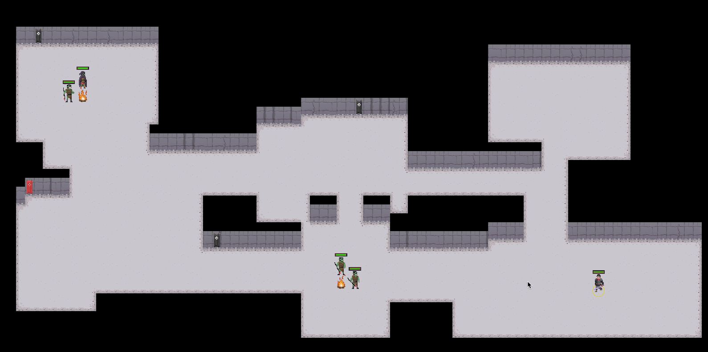

# roguelike

A WIP procedurally generated RPG built using the [Amethyst ECS system](https://amethyst.rs/) inspired by top down party-system games such as dragon age and roguelike strategy games such as FTL.



While learning the amethyst framework I saw many examples of single controlled characters using keyboard inputs - instead I wanted to have dynamically controlled characters and mouse controls. I was also inspired by the fantastic [roguelike tutorial](https://tomassedovic.github.io/roguelike-tutorial/) that is already popular among introductions to rust development. Im making this publically available to hopefully help others that want to do the same. Some of this code is not great, but it is functional and a WIP.

## How to run

To run the game, run the following command, which defaults to the `metal` graphics backend:

```bash
cargo run --release
```

Windows and Linux users may explicitly choose `"vulkan"` with the following command:

```bash
cargo run --release --no-default-features --features "vulkan"
```

Mac OS X users may explicitly choose `"metal"` with the following command:

```bash
cargo run --release --no-default-features --features "metal"
```
